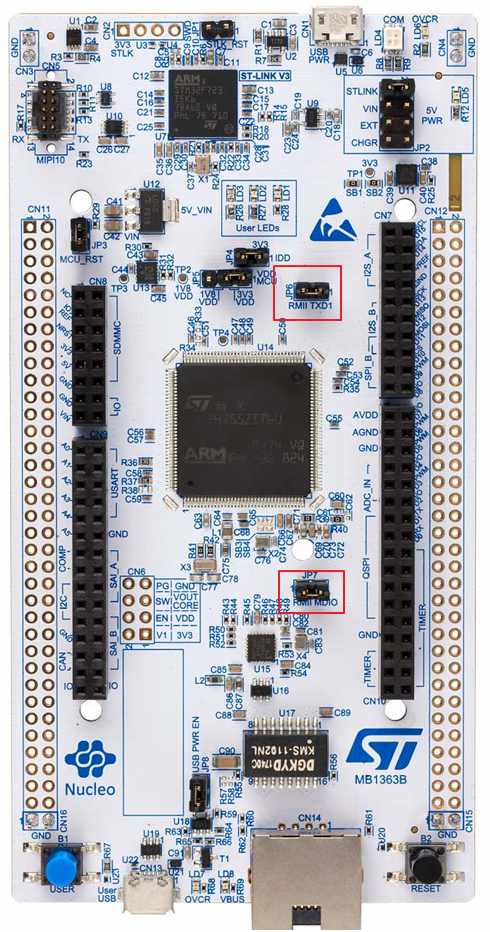

# STM32H755ZI-Q Ethernet + LwIP 網路建立與除錯紀錄

## 專案簡介

本專案使用 STM32H755ZI-Q NUCLEO 開發板建立 Ethernet 網路功能，採用：

* STM32H755ZIT6
* Cortex-M4
* LAN8742A PHY
* RMII（Reduced Media Independent Interface）介面
* STM32 HAL Ethernet Driver
* LwIP TCP/IP Stack

最終目標：

* 建立穩定 Ethernet 通訊
* Ping 測試成功
* 作為後續 FTP Server 開發基礎

---

# 開發環境

MCU：

STM32H755ZIT6

開發板：

NUCLEO-H755ZI-Q

PHY：

LAN8742A

網路堆疊：

LwIP

開發工具：

* STM32CubeMX
* STM32CubeIDE

執行核心：

* Cortex-M4

---

# 最終結論（非常重要）

經過超過 30 小時除錯後，最終發現問題並非軟體，而是硬體 Jumper 設定。

## 根本原因

NUCLEO-H755ZI-Q 開發板：

必須確認

JP6（RMII TXD1）

已安裝 Jumper。

若 JP6 未連接：

* PHY 可正常 Link Up
* MDIO 可正常通訊
* LAN8742 初始化成功
* HAL_ETH_Init 成功
* HAL_ETH_Start 成功
* 網路孔 LED 顯示正常

但是：

* ARP Reply 無法正確送出
* ICMP Reply 無法正確送出
* Ping 永遠失敗

---

# 硬體設定

## 必須確認

### JP6

功能：

RMII TXD1

狀態：

必須插上 Jumper

否則 Ethernet 傳送資料不完整。




---

# 除錯流程紀錄

---

# STEP 1：確認 PHY 是否存在

檔案：

```text
CM4/LWIP/Target/ethernetif.c
```

函數：

```c
LAN8742_Init(&LAN8742)
```

位置：

```c
low_level_init()
```

測試程式：

```c
if(LAN8742_Init(&LAN8742) != LAN8742_STATUS_OK)
{
    HAL_GPIO_WritePin(GPIOE, GPIO_PIN_1, GPIO_PIN_SET);
}
```

結果：

成功

證明：

* PHY 存在
* MDIO 正常
* MDC 正常
* PHY Address 正確

---

# STEP 2：確認 HAL_ETH_Init()

檔案：

```text
CM4/LWIP/Target/ethernetif.c
```

函數：

```c
HAL_ETH_Init(&heth)
```

位置：

```c
low_level_init()
```

測試：

```c
hal_eth_init_status = HAL_ETH_Init(&heth);
```

結果：

成功

證明：

* ETH MAC 初始化成功
* DMA 初始化成功
* Descriptor Ring 建立成功

---

# STEP 3：確認 RX Descriptor 建立成功

檔案：

```text
CM4/LWIP/Target/ethernetif.c
```

函數：

```c
low_level_init()
```

測試：

```c
heth.RxDescList.RxDesc[0]
```

驗證：

```c
addr = heth.RxDescList.RxDesc[0];
```

結果：

位於有效 SRAM 區域

證明：

* Descriptor Ring 已建立
* HAL_ETH_Init() 已正常執行

---

# STEP 4：確認 PHY Link Up

檔案：

```text
CM4/LWIP/Target/ethernetif.c
```

函數：

```c
ethernet_link_check_state()
```

測試：

```c
LAN8742_GetLinkState()
```

結果：

Link Up

證明：

* 網路線正常
* PHY Auto Negotiation 成功
* RMII REF_CLK 正常

---

# STEP 5：確認 HAL_ETH_Start()

檔案：

```text
CM4/LWIP/Target/ethernetif.c
```

函數：

```c
ethernet_link_check_state()
```

程式：

```c
HAL_ETH_Start(&heth);
```

結果：

成功

證明：

* ETH DMA 啟動成功
* MAC RX/TX 啟動成功

---

# STEP 6：確認 MAC 接收器啟動

檔案：

```text
CM4/LWIP/Target/ethernetif.c
```

測試：

```c
uint32_t maccr;

maccr = ETH->MACCR;
```

驗證：

```c
ETH_MACCR_RE
```

結果：

Enable

證明：

* MAC Receiver 已啟動

---

# STEP 7：確認 RX Buffer 配置

檔案：

```text
CM4/LWIP/Target/ethernetif.c
```

函數：

```c
HAL_ETH_RxAllocateCallback()
```

測試：

```c
HAL_GPIO_TogglePin(...)
```

結果：

Callback 被呼叫

證明：

* DMA RX Buffer 已配置
* LwIP Memory Pool 正常
* Descriptor 與 Buffer 已建立

---

# STEP 8：確認 LwIP 收包流程

檔案：

```text
CM4/LWIP/Target/ethernetif.c
```

函數：

```c
low_level_input()
```

確認：

```c
if(RxAllocStatus == RX_ALLOC_OK)
```

成立。

證明：

* ethernetif_input() 正在執行
* LwIP Polling 正常運作

---

# STEP 9：確認目前運作模式

檔案：

```text
CM4/LWIP/Target/ethernetif.c
```

函數：

```c
ethernet_link_check_state()
```

實際程式：

```c
HAL_ETH_Start(&heth);
```

不是：

```c
HAL_ETH_Start_IT(&heth);
```

因此：

目前系統使用：

```text
Polling Mode
```

而非：

```text
Interrupt Mode
```

---

# STEP 10：發現 HAL_ETH_ReadData() 失敗

檔案：

```text
CM4/LWIP/Target/ethernetif.c
```

函數：

```c
low_level_input()
```

程式：

```c
HAL_ETH_ReadData(&heth, (void **)&p);
```

現象：

```c
p == NULL
```

且：

```c
HAL_ETH_ReadData()
!= HAL_OK
```

成為主要可疑點。

---

# STEP 11：檢查 DMA Descriptor OWN Bit

檔案：

```text
CM4/LWIP/Target/ethernetif.c
```

測試：

```c
rxdesc->DESC3 & 0x80000000
```

結果：

```text
OWN = 1
```

代表：

DMA 永遠持有 Descriptor。

表示：

* CPU 從未取得完成封包

---

# STEP 12：檢查 RxLinkCallback

檔案：

```text
CM4/LWIP/Target/ethernetif.c
```

函數：

```c
HAL_ETH_RxLinkCallback()
```

測試：

```c
HAL_GPIO_WritePin(GPIOB,
                  GPIO_PIN_0,
                  GPIO_PIN_SET);
```

結果：

從未進入

證明：

DMA 沒有成功完成接收流程。

---

# STEP 13：懷疑硬體問題

軟體驗證結果：

| 項目          | 結果 |
| ----------- | -- |
| PHY 初始化     | OK |
| MDIO 通訊     | OK |
| Link Up     | OK |
| Descriptor  | OK |
| DMA 啟動      | OK |
| LwIP        | OK |
| Memory Pool | OK |

幾乎所有軟體條件都成立。

因此開始檢查：

* RMII 訊號
* Jumper 設定

---

# STEP 14：找到根因

發現：

JP6

```text
RMII TXD1
```

未接上 Jumper。

安裝 JP6 後：

立即成功：

```bash
ping 192.168.88.10
```

收到：

```text
Reply from 192.168.88.10
```

---

# 最終驗證結果

成功確認：

* LAN8742 PHY
* MDIO
* MDC
* RMII
* ETH MAC
* ETH DMA
* Descriptor Ring
* LwIP
* Polling Mode
* ICMP Ping

全部正常運作。

---

# 後續開發計畫

下一階段：

* FTP Server
* SD Card 檔案存取
* 檔案上傳下載
* 遠端資料擷取
* Ethernet 檔案管理系統

---

# 專案狀態

✅ Ethernet Driver 正常

✅ LAN8742 正常

✅ LwIP 正常

✅ Ping 成功

✅ 可進入 FTP Server 開發階段

---

# CM7 要修改的檔案 - main.c

```c
#define DUAL_CORE_BOOT_SYNC_SEQUENCE  // 必須存在

int main(void)
{
    HAL_Init();
    SystemClock_Config();
    // 喚醒 Cortex-M4 核心
    HAL_PWREx_ReleaseCore(PWR_CORE_CPU2);// 這是重點 

    BspCOMInit.BaudRate   = 115200;
    BspCOMInit.WordLength = COM_WORDLENGTH_8B;
    BspCOMInit.StopBits   = COM_STOPBITS_1;
    BspCOMInit.Parity     = COM_PARITY_NONE;
    BspCOMInit.HwFlowCtl  = COM_HWCONTROL_NONE;
    if (BSP_COM_Init(COM1, &BspCOMInit) != BSP_ERROR_NONE)
    {
        Error_Handler();
    }

    /* ------------------ CRITICAL MODIFICATION BEGIN ------------------ */
    
    // 1. 啟用 SYSCFG 時脈（SYSCFG 位於 APB4 總線，控制了全晶片的引腳網路模式切換）
    __HAL_RCC_SYSCFG_CLK_ENABLE();

    // 2. 強制將乙太網路硬體介面切換為 RMII 模式。
    //    這行硬體設定必須在 CM4 核心啟動並初始化網路之前，由 CM7 先行在底層組態完成！
    HAL_SYSCFG_ETHInterfaceSelect(SYSCFG_ETH_RMII);

    /* ------------------- CRITICAL MODIFICATION END ------------------- */

    /* Infinite loop */
    /* USER CODE BEGIN WHILE */
    while (1)
    {
        /* USER CODE END WHILE */

        /* USER CODE BEGIN 3 */
    }
    /* USER CODE END 3 */
    }
```

---

> [!WARNING]
> NUCLEO-H755ZI-Q 使用 RMII Ethernet 時，
> 請務必確認 JP6（RMII TXD1）已安裝 Jumper。
>
> 若 JP6 未接上：
>
> - PHY Link Up 正常
> - LAN8742_Init() 成功
> - HAL_ETH_Init() 成功
> - 網路孔 LED 正常
>
> 但 Ping 會永遠失敗。

---

作者：

Herman Ku

平台：

STM32H755ZI-Q + LAN8742 + LwIP

完成日期：

2026-06-04
